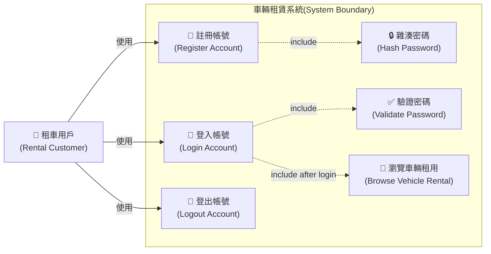

# UC_01 車輛租賃系統 － 帳號管理 Use Case Diagram

---

## Use Case 說明

### UC01 － 註冊帳號（Register Account）

| 項目 | 說明 |
|------|------|
| **Use Case 名稱** | 註冊帳號 |
| **Actor** | 租車用戶（Rental Customer） |
| **前置條件** | 用戶尚未擁有帳號 |
| **主要流程** | 1. 用戶填寫使用者名稱、電子郵件、密碼、確認密碼 2. 系統驗證輸入資料 3. 系統檢查 Email 是否已被註冊 4. **\[include\]** 系統對密碼進行雜湊處理（Hash Password） 5. 系統建立新帳號並儲存 6. 系統導向登入頁面 |
| **替代流程** | Email 已存在 → 顯示錯誤訊息，要求重新輸入 |
| **後置條件** | 新帳號成功建立於資料庫中 |

---

### UC02 － 登入帳號（Login Account）

| 項目 | 說明 |
|------|------|
| **Use Case 名稱** | 登入帳號 |
| **Actor** | 租車用戶（Rental Customer） |
| **前置條件** | 用戶已完成帳號註冊 |
| **主要流程** | 1. 用戶輸入電子郵件與密碼 2. 系統查詢對應帳號 3. **\[include\]** 系統驗證密碼（Validate Password） 4. 系統建立登入 Session 或 JWT Token 5. 系統導向車輛租用頁面 |
| **替代流程** | 帳號不存在或密碼錯誤 → 顯示錯誤訊息 |
| **後置條件** | 用戶成功登入，取得授權存取車輛租用功能 |

---

### UC03 － 驗證密碼（Validate Password）【include】

| 項目 | 說明 |
|------|------|
| **Use Case 名稱** | 驗證密碼 |
| **觸發來源** | UC02 登入帳號（include） |
| **說明** | 將用戶輸入的密碼進行雜湊後，與資料庫中儲存的 `PasswordHash` 比對，回傳驗證結果。 |

---

### UC04 － 雜湊密碼（Hash Password）【include】

| 項目 | 說明 |
|------|------|
| **Use Case 名稱** | 雜湊密碼 |
| **觸發來源** | UC01 註冊帳號（include） |
| **說明** | 使用安全雜湊演算法（如 BCrypt）對用戶輸入的明文密碼進行雜湊，確保密碼不以明文形式儲存。 |

---

### UC05 － 登出帳號（Logout Account）

| 項目 | 說明 |
|------|------|
| **Use Case 名稱** | 登出帳號 |
| **Actor** | 租車用戶（Rental Customer） |
| **前置條件** | 用戶已登入 |
| **主要流程** | 1. 用戶點擊登出 2. 系統清除登入 Session 或使 JWT Token 失效 3. 系統導向首頁 |
| **後置條件** | 用戶登入狀態已清除 |

---

### UC06 － 瀏覽車輛租用（Browse Vehicle Rental）

| 項目 | 說明 |
|------|------|
| **Use Case 名稱** | 瀏覽車輛租用 |
| **Actor** | 租車用戶（Rental Customer） |
| **前置條件** | 用戶已成功登入（UC02 完成後觸發） |
| **說明** | 登入成功後，系統自動導向車輛租用功能頁面，用戶可瀏覽可租用的車輛清單。 |
